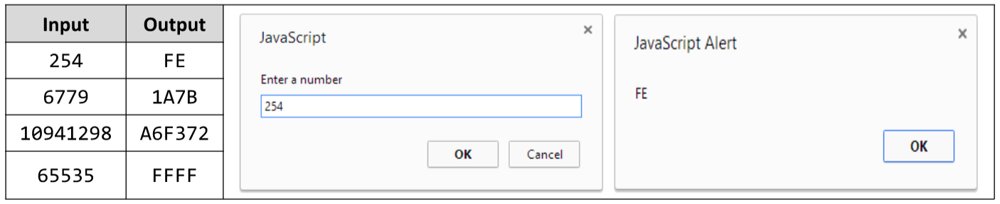

# Decimal to hexadecimal
Write a JavaScript code in a Web page dec2hex.html that enters a positive integer number "num" and converts it to a hexadecimal form. The input should be entered as JavaScript prompt window. The output should be
shown as browser popup window (alert). 
Examples:

# 