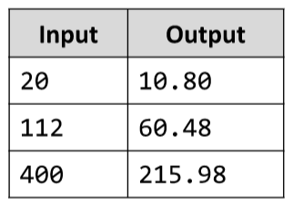

# Calculate knots
Write a JavaScript function that accepts a number variable to convert from km/h to knots (knot is a maritime unit
measuring speed). The result should be printed on the console, rounded up to the second sign after the decimal
point. Run the program through Node.js.
Examples:

# 