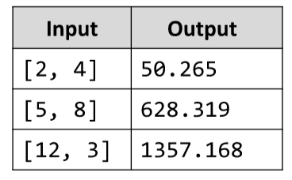

# Cylinder Volume
Write a JavaScript function calcCylinderVol(arr) that accepts the following parameters: radius and the height of a
straight circular cylinder. The function calculates the volume of the cylinder. Write JS program cylinderVol.js that
calculates the volume of a few cylinders. The result should be printed on the console. Run the program through
Node.js. Examples:

# 