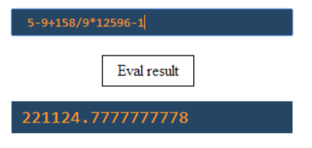

# Calculate Expression
Write a HTML page (with text field, button, and paragraph). Write JS program calcExpression.js that calculates any
expression put in the text field and prints it in the paragraph. Link the JS file to the HTML file. Example:

# 