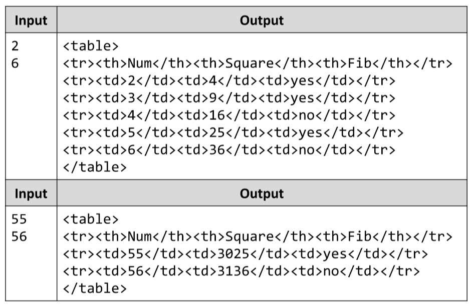

# Build a Table
  Write a JavaScript function that takes as input an array of two numbers (__start__ and __end__) and prints at the console a
  HTML table of 3 columns. The first column should hold a number __num__, changing from __start__ to __end__. The second
  column should hold __num*num__. The third column should hold __"yes"__ if num is Fibonacci number or __"no"__ otherwise.
  The table should have header cells titled __"Num"__, __"Square"__; and __"Fib"__.

  ## Input:
  The input data comes as __array of two numbers__: __start__ and __end__. The input data will always be valid and in the format
  described. There is no need to check it explicitly.

  ## Output:
  Print at the console the above described __table__ in the same format like the examples below. Don't add additional
  spaces. __Whitespace__ and character __casing__ are important, so please use the same as in the below examples.

  ## Constraints:
  - The input is passed to the first JavaScript function found in your code as array of 2 elements.
  - The numbers __start__ and __end__ are positive integers in the range [1…1 000 000] and __start__ ≤ __end__.
  - Allowed working time for your program: 0.2 seconds.
  - Allowed memory: 16 MB
  - Examples:

# 