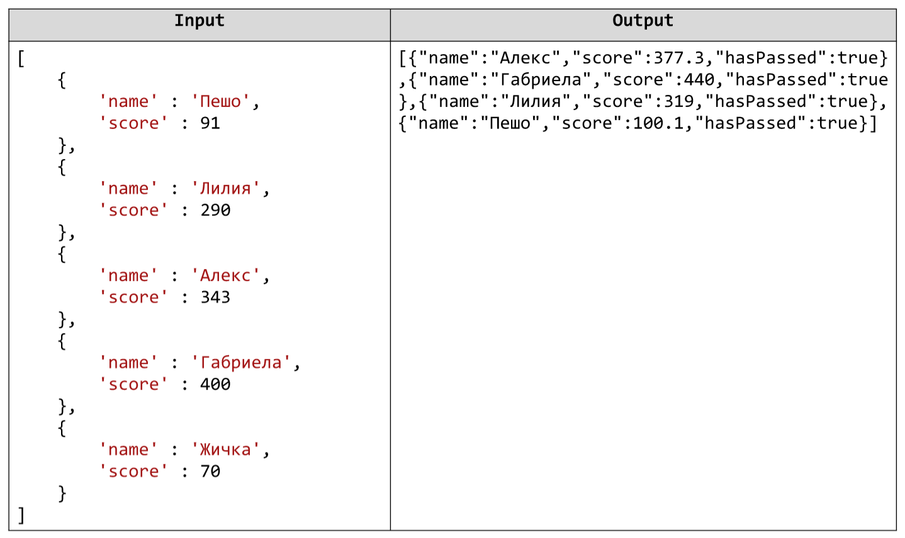

# Course Grade Scaling *
You are given a JSON string containing an array of Students (Objects). Your task is to scale their scores upwards by
increasing them with 10%. After that you should add a field that shows whether the student has passed or failed
the exam (passed exam means 100 or more points at the exam). Finally you should filter out only the students that
have passed the exam and print them out sorted alphabetically. Example:

# 