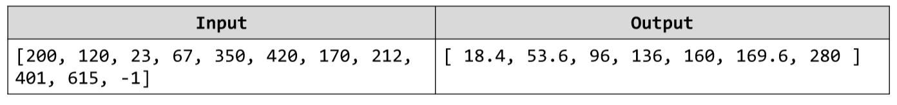

# Score Modification
You are given an array of numbers. Your tasks are to first filter out all valid exam scores (between 0 and 400) and
afterwards scale them downwards by removing 20% out of each score. Finally you should print out the changed
scores sorted in ascending order. Example:

# 