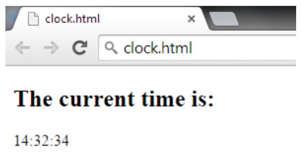

# Clock
Write a JavaScript function in a Web page clock.html that shows the current time in format hh:mm:ss. 
The time should update itself so that it works as a clock. A sample output is shown below:

# 