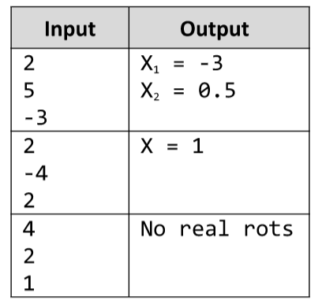

# Quadratic Equation
Write a script that enters the coefficients a, b and c of a quadratic equation a*x^2 + b*x + c = 0 
and calculates and prints its real roots. Note that quadratic equations may have 0, 1 or 2 real roots.

# 