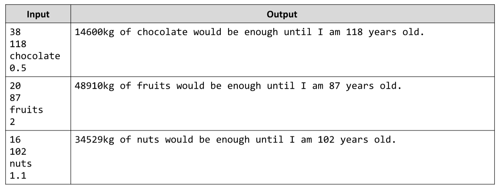

# The Lifetime Supply Calculator
Write a JavaScript function calcSupply(age, maxAge, food, foodPerDay) that accepts the following parameters: your
age (years), your maximum age (years), your favorite food name (e.g. &quot;chocolate&quot;), estimate amount of your
favorite food per day (a number). The function calculates how many of the food you will eat for the rest of your life.
Write JS program lifetimeSupplyCalc.js that calculates the amount of a few foods that you will eat. The result should
be printed on the console. Run the program through Node.js. Note: we assume that there are no leap years.
Examples:

# 