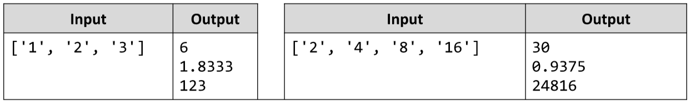

# Aggregate elements
Write a JS program that performs and outputs different operations on an array of elements.
Implement the following operations:
1.Sum(a) - calculates the sum all elements from the input array
2.Sum(1/a) - calculates the sum of the inverse values (1/a) of all elements from the array
3.Concat(a) - concatenates the string representations of all elements from the array
The input comes as an array of elements that must be parsed as numbers, where necessary.
The output should be printed on the console on a new line for each of the operations.
Examples:

# 