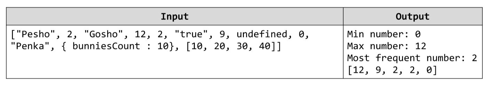

# Array Manipulator
You are given an array of objects. Your task is to write a JavaScript code that filters out the numbers of that array
(removes all non-number objects). Then you should: 
1. Find the Min number, 
2. Find the Max number, 
3. Find the most frequent number. 
Finally you should print out the numbers you have found and the filtered array sorted in
descending order. Example:

# 