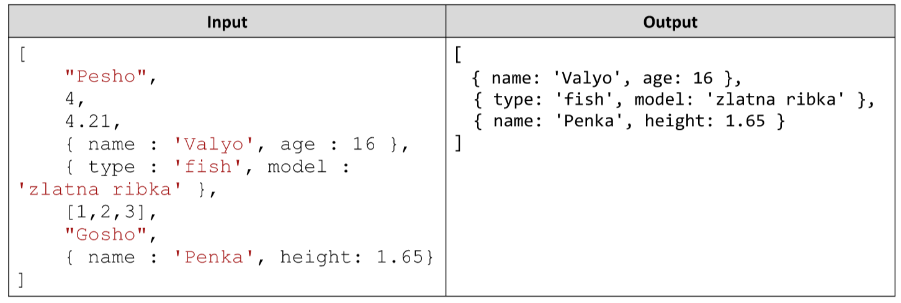

# Array Object Extractor
Write a JavaScript function extractObjects(array). As a function argument you are given an array of different objects
with different data types. Your task is to write the JavaScript function that filters out the Objects (all primitive data
type objects and arrays are filtered) and returns a new array with the extracted elements. 
Note: Try to write the filter algorithm yourself and not use .filter() function. 
Hint: Use procedural for loop)
Example:

# 