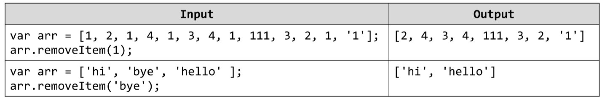

# Array Prototype Function
Write a JavaScript function removeItem(value) that accept as parameter a number or string. The function should
remove all elements with the given value from an array. Attach the function to the Array type. You may need to
read about prototypes in JavaScript and how to attach methods to object types. You should return as a result the
modified array. Write a sample program to demonstrate that your function works correctly for the examples below.
Example:

# 