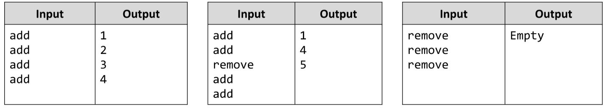

# Add and Remove Elements from Array *
Write a JS function that adds and removes numbers to / from an array. 
You will receive a command which can either be “add” or “remove”.
The initial number is 1. Each input command should increase that number, regardless of what it is.
Upon receiving an “add” command you should add the current number to your array.
Upon receiving the “remove” command you should remove the last entered number, currently existent in the array.
The input comes as array of strings. Each element holds a command.
The output is the array itself, with each element printed on a new line. In case of an empty array, just print “Empty”.
Example:

# 

