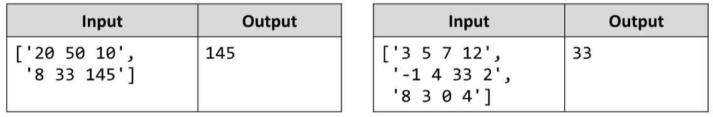

# Biggest Element
Write a JS function that finds the biggest element inside a matrix.
The input comes as array of string elements. 
Each element contains the elements from one row of a matrix, separated by space.
The output is the return value of your function. Find the biggest element and return it.
Example:

# 
