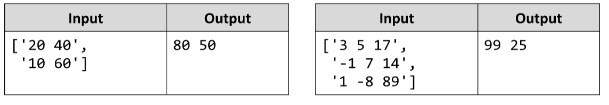

# Diagonal Sums *
A square matrix of numbers comes as an array of strings, each string holding numbers (space separated). 
Write a JS function that finds the sum at the main and at the secondary diagonals.
The input comes as array of string elements. 
Each element contains the elements from one row of a matrix, separated by space.
The output is printed on the console, on a single line separated by space. First print the sum at the main diagonal,
then the sum at the secondary diagonal.
Example:

# 