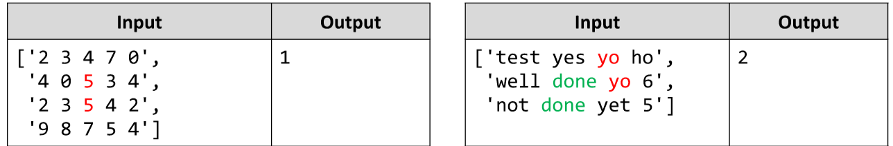

# Equal Neighbors *
Write a JS function that finds the number of equal neighbor pairs inside a matrix of variable size and type (numbers
or strings).
The input comes as array of string elements. 
Each element contains the elements from one row of a matrix,separated by space.
The output is return value of you function. Save the number of equal pairs you find and return it.
Example:

# 