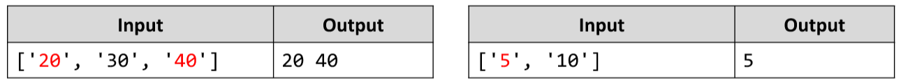

# Even Position Element
Write a JS function that finds the elements at even positions in an array.
The input comes as array of string elements holding numbers.
The output is the return value of your function. Collect all elements in a string, separated by space.
Example:

# 

