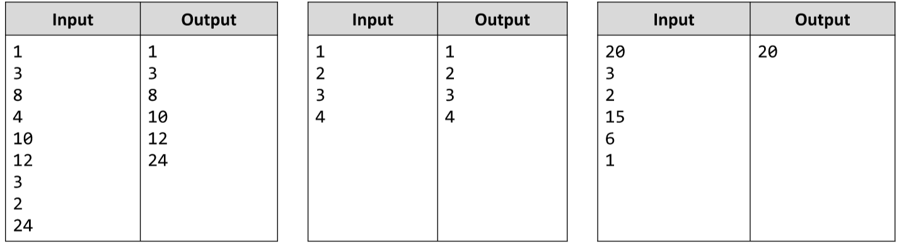

# Extract an Non-decreasing Subsequence from an Array
Write a JS function that extracts only those numbers that form a non-decreasing subsequence. In other words, you
start from the first element and continue to the end of the given array of numbers. Any number which is LESS
THAN the current biggest one is ignored, alternatively if it’s equal or higher than the current biggest one you set it
as the current biggest one and you continue to the next number.
The input comes as array of strings. Each element will represent a number.
The output is the processed array after the filtration, which should be a non-decreasing subsequence. 
Each element should be printed on a new line.
Example:

# 
