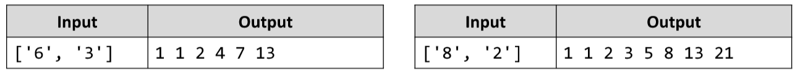

# Last K Numbers Sequence
You are given two integers n and k. Write a JS function that generates and prints the following sequence:
- The first element is 1
- Every following element equals the sum of the previous k elements
- The length of the sequence is n elements
The input comes as array of two string elements holding numbers. The first element represents the number n, and the second – the number k.
The output is printed on the console on a single line, separated by space.
Examples:

# 

