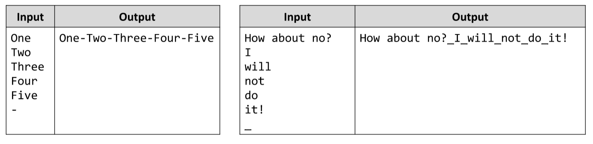

# Print an Array with a given Delimiter
Write a JS function that prints a given array.
The input comes as array of strings. The last element of the array is the delimiter.
The output is the same array, printed on the console, each element separated from the others by the given
delimiter.
Examples:

# 
