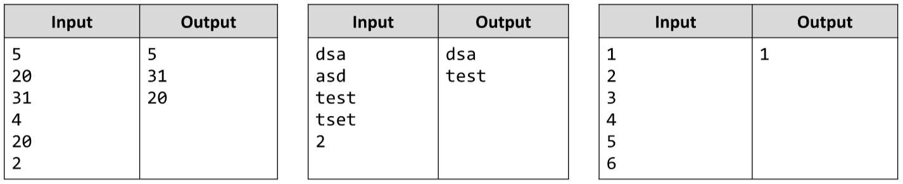

# Print every N-th Element from an Array
Write a JS function that prints every element of an array, on a given step.
The input comes as array of strings. The last element is N - the step.
The output is every element on the N-th step starting from the first one. 
If the step is “3”, you need to print the 1-st, the 4-th, the 7-th … and so on, until you reach the end of the array. 
The elements must be printed each on a new line.
Examples:

# 
