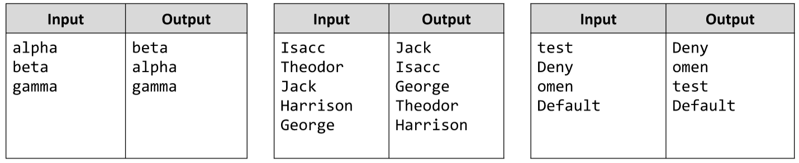

# Sort an Array by 2 Criteria
Write a JS function that orders a given array of strings, by length in ascending order as primary criteria, and by
alphabetical value in ascending order as second criteria. 
The comparison should be case-insensitive.
The input comes as array of strings.
The output is the ordered array of strings.
Example:

# 