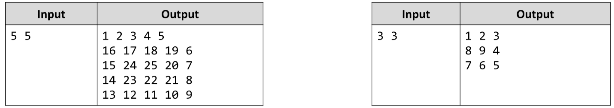

# Spiral Matrix *
Write a JS function that generates a Spirally-filled matrix with numbers, with given dimensions.
The input comes as array of strings. There will be exactly one element, containing the dimensions of the matrix,
which will be 2 numbers separated by a space.
The output is the matrix filled spirally starting from 1. You need to print every row on a new line, with the cells
separated by a space.
Example:

# 