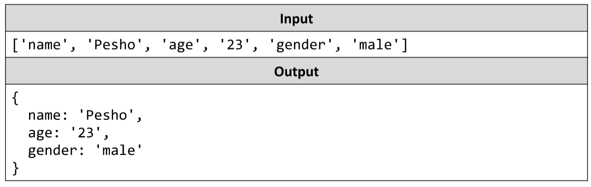

# Assign Properties
Write a JS function that composes an object by given properties. 
There will be 3 sets of property-value pairs (a total of 6 elements). 
Assign each value to its respective property of an object and return the object as a result of the function.
The input comes as an array of string elements.
The output should be returned as a value.
Example:

# 