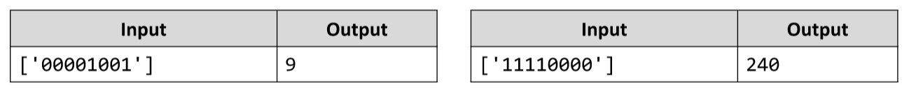

# Binary to Decimal
Write a JS function that reads an 8-bit binary number and converts it to a decimal.
The input comes as an array of one string element, representing a binary number.
The output should be printed to the console. 
Example:

# 