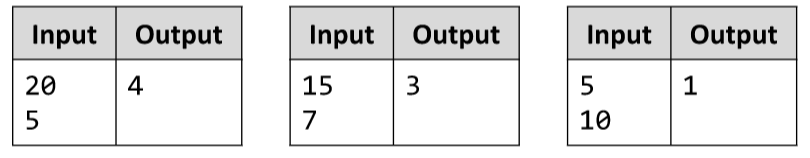

# Boxes and Bottles
Write a JS function to calculate how many boxes will be needed to fit n bottles if each box fits k bottles.
The input comes as array of strings, where each element holds a number. 
The first element is the number of bottles and the second is the capacity of a single box.
The output should be printed to the console.
Example:

# 