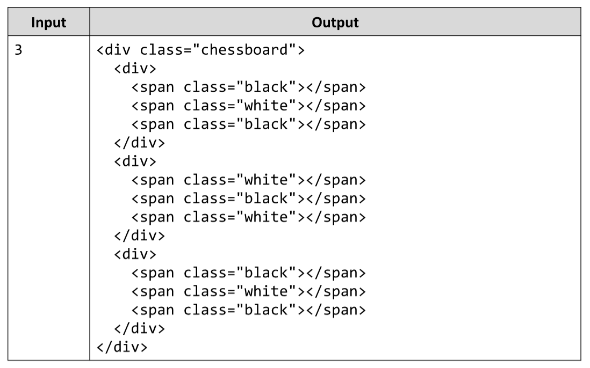

# Chess Board
Write a JS function to print a chessboard of size n X n. See the example for more information.
The input comes as array of one string element, holding the number n.
The output should be returned as a result of your function in the form of a string. 
Example:

# 