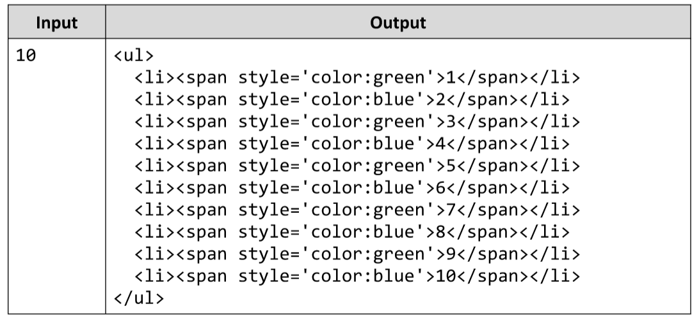

# Colorful Numbers
Write a JS function to print the numbers from 1 to n. 
Return a string holding HTML list with the odd lines in blue and even lines in green. See the example for more information.
The input comes as array of one string element, holding the number n.
The output should be returned as a result of your function in the form of a string. 
Example:

# 