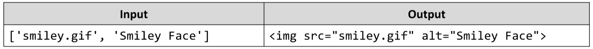

# Compose Tag
Write a JS function that composes an HTML image tag.
The input comes as an array of string elements.
The first element is the location of the file and the second is the alternate text.
The output should be printed to the console.
Example:

# 