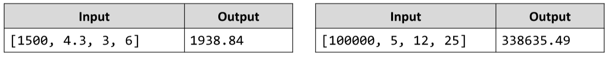

# Compound Interest
Write a JS function that calculates the total accumulated value for a monetary deposit by given principal sum,
interest rate, compounding frequency and overall length.
The input comes as an array of strings that need to be parsed as a numbers. The first value is the principal sum, the
second is the interest rate in percent, the third is the compounding period in months and the final value is the total
timespan, given in years.
The output should be printed to the console, with two decimal places.
Note that at the beginning of the task you are given the compounding period, which is inversely related to the
frequency. You need to express the frequency as how many times in a year the interest is compounded. For
instance, a 3-month period means the interest will be updated 4 times in a year. 
Any percentages need to be expressed as a fraction.
Example:

# 