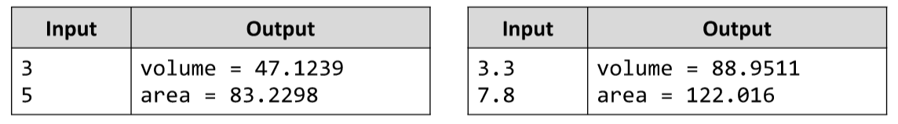

# Cone
Write a JS function to calculate a cone’s volume and surface area by given height and radius at the base.
The input comes as array of two string elements, each holding a number. 
The first element is the cone’s radius and the second is its height.
The output should be printed to the console on a new line for every result. 
Example:

# 