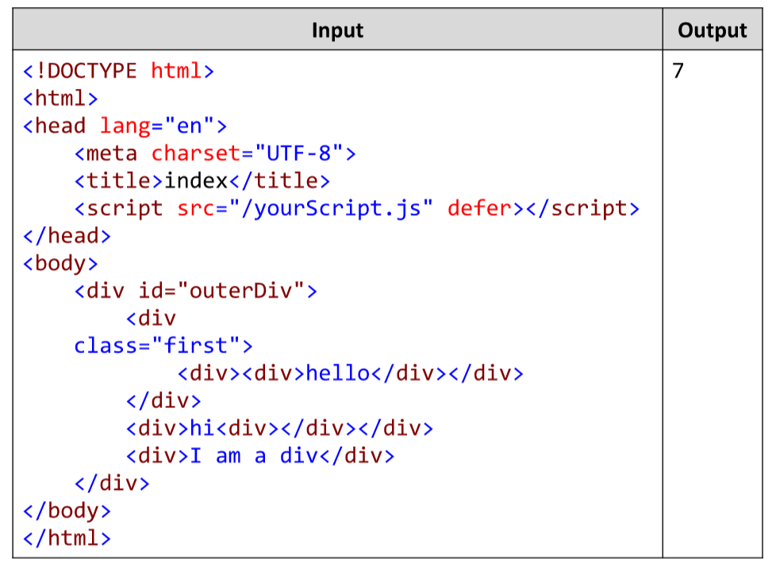

# Count Number of DIVs
Write a JavaScript function countDivs(html) to count the number of all DIVs in given HTML fragment passed as
string. Write a JS program countOfDivs.js that invokes your function and prints the output at the console. 
Examples:

# 