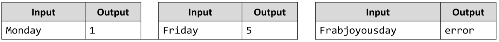

# Day of The Week
Write a JS function that prints a number between 1 and 7 when a day of the week is passed to it as a string and an
error message if the string is not recognized.
The input comes as an array with one string element in it.
The output should be returned as a result of your program.
Examples:

# 