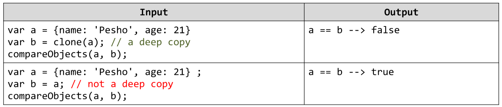

# Deep Copy of Object *
Write a JavaScript function clone(obj) that accepts as parameter an object of reference type. 
The function should return a deep copy of the object. Write a second function compareObjects(obj, objCopy) that compare the two objects by reference (==) and print on the console the output given below. Read in Internet about 'deep copy' of an object and how to create it.
Example:

# 