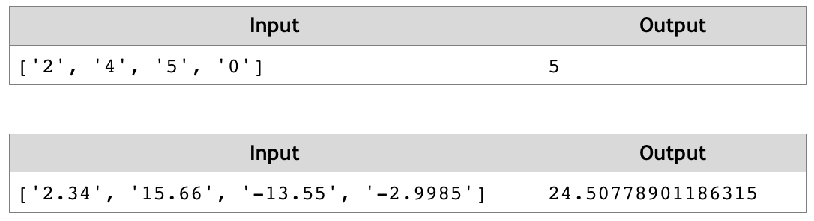

# Distance between Points
Write a JS function that calculates the distance between two points by given x and y coordinates. 
Use objects to store the two points.
The input comes as array of four string elements in the format [x1, y1, x2, y2] that need to be parsed as numbers.
Each pair of elements are the coordinates of a point in 2D space.
The output should be returned as a result of your function.
Example:

# 