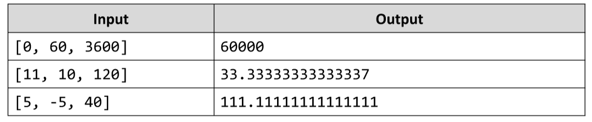

# Distance over Time
Two objects start from point A and travel in the same direction at constant speeds V1 and V2 for a period T. 
Write a JS function that calculates the distance between the two object at the end of the period.
The input comes as array of strings that need to be parsed as numbers. The first two elements are the speeds to the
two objects in km/h and the third element is the time in seconds.
The output should be printed to the console. Calculate the distance in meters.
Example:

# 