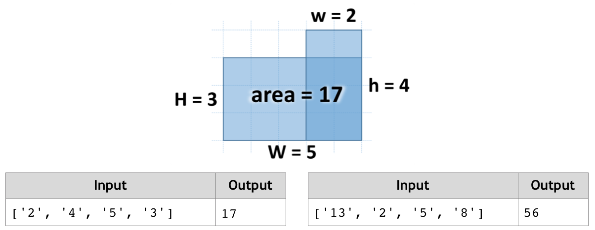

# Figure Area
Write a JS function that calculates the area of the figure on the right by given values for w, h, W and H. 
The lower right corner is always common for the two rectangles.
The input comes as array of string elements that need to be parsed as numbers.
The output should be returned as a result of your function
Example:

# 