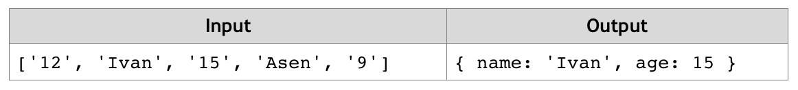

# Filter by Age
Write a JS function that stores the name and age of two persons in objects and then filters them by minimum age.
The input comes as array of string elements. The first element is the minimum age. The second and third elements are the name and age of the first person and the fourth and fifth elements – the name and age of the second person. The three age parameters need to be parsed as numbers.
The output should be printed to the console.
Example:

# 