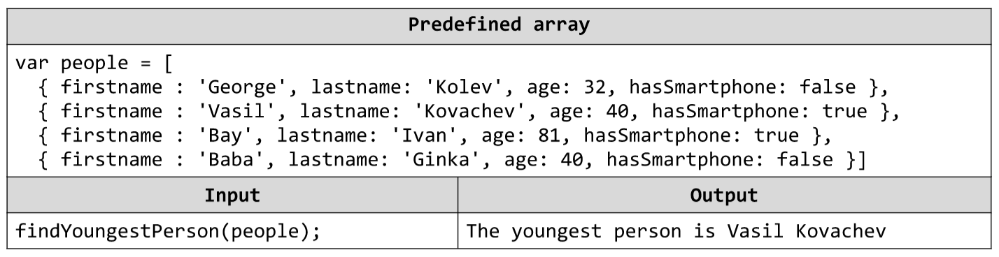

# Find Youngest Person
Write a JavaScript function findYoungestPerson(array) that accepts as parameter an array of people, finds the
youngest person that has a smartphone and returns his full name. Write a JS program youngestPerson.js to execute
your function for the below examples and print the result at the console.

# 