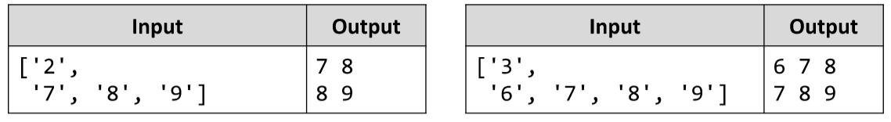

# First and Last K Numbers
Write a JS function that prints the first k and the last k elements from an array of numbers.
The input comes as array of string elements holding numbers. 
The first element represents the number k, all other elements are from the array that needs to be processed.
The output is printed on the console on two lines. On the first line print the first k elements, separated by space. On
the second line print the last k elements, separated by space.

# 
