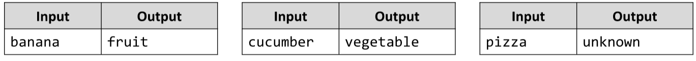

# Fruit or Vegetable
Write a JS function to print 'fruit', 'vegetable' or 'unknown' depending on the input string.
__Fruits__ are: banana, apple, kiwi, cherry, lemon, grapes, peach.
__Vegetable__ are: tomato, cucumber, pepper, onion, garlic, parsley.
All others are unknown.
The input comes as array of one string element, the name of the fruit.
The output should be printed to the console.

# 