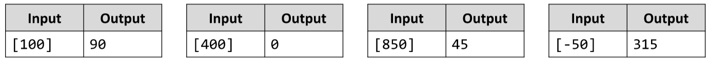

# Grads to Degrees
Land surveyors use grads (also known as gon, 400 grads in a full turn) in their documents.
Grads are rather unwieldy though, so you need to write a JS function that converts from grads to degrees. 
In addition, your program needs to constrain the results within the range , so if you arrive at a value like -15°, it needs to be converted to 345° and 420° becomes 60°.
The input comes as an array of one string element that needs to be parsed as a number.
The output should be printed to the console.

# 