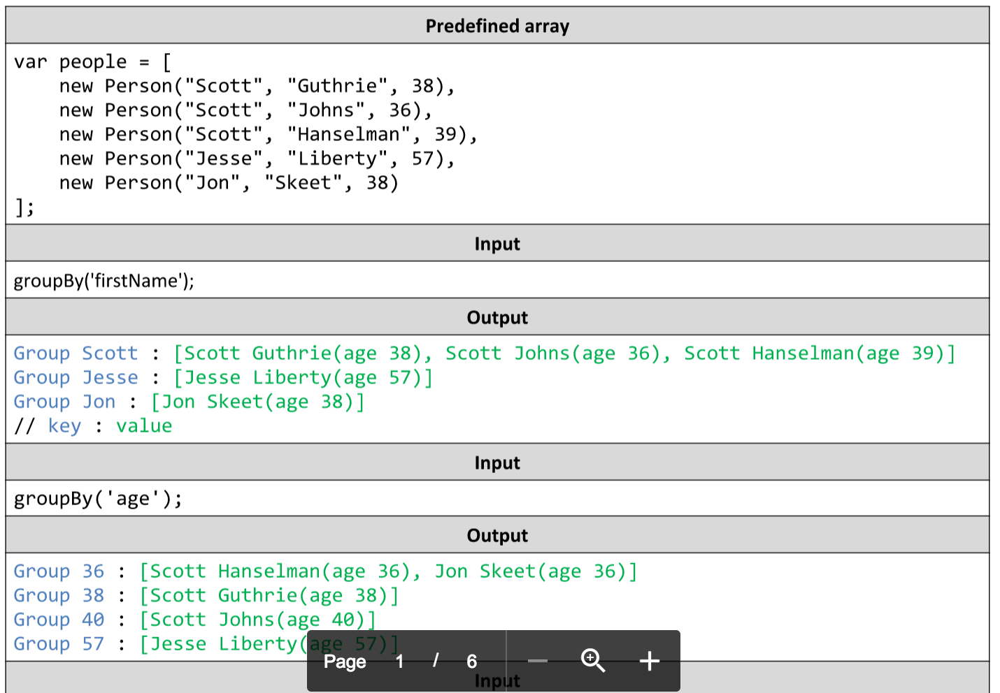

# Group People
Write a JavaScript function groupBy('criteria') that groups an array of people by age, first or last name. Create a
Person constructor to add every person in the person array. The groupBy('criteria') function must return an object,
with keys – the groups (age, firstName and lastName) and values – arrays with people in this group. Print on the
console every entry of the returned object. Use function overloading (i.e. just one function).
You may need to find how to use constructors. Examples:

# 