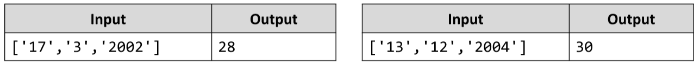

# Last Month *
Write a JS function that receives a date as array of strings containing day, month and year in that order.
Your task is to print the last day of previous month (the month BEFORE the given date). 
Check the examples to better understand the problem.
The input comes as an array of string elements.
The output should be a single number representing the last day of the previous month.
Examples:

# 

