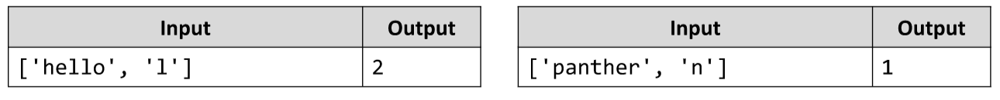

# Letter Occurrences in String
Write a JS function that counts how many times a specific letter occurs in a given string.
The input comes as array of string elements. 
The first element is the string to check and the second element is the letter to count.
The output should be returned as a result of your function.
Example:

# 