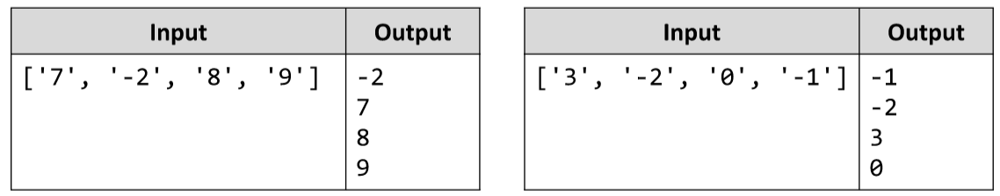

# Negative vs Positive Numbers
Write a JS function that processes the elements in an array one by one and produces a new array. 
Prepend each negative element at the front of the result and append each positive (or 0) element at the end of the result.
The input comes as array of string elements holding numbers.
The output is printed on the console, each element on a new line.
Examples:

# 

