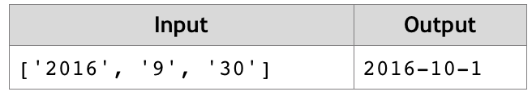

# Next Day
Write a JS function that calculates the date of the next day by given year, month and day.
The input comes as array of three string elements that need to be parsed as numbers. 
The first element is the year, the second is the month and the third is the day.
The output should be returned as a result of your function.
Example:

# 