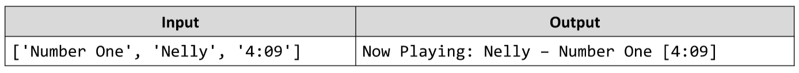

# Now Playing
Write a JS function that displays information about the currently playing musical track.
The input comes as an array of string elements. 
The first element is the name of the track, the second is the name of
the artist performing and the third is the duration in minutes and seconds.
The output should be printed to the console in the following format:
__Now Playing: {artist name} - {track name} [{duration}]__
Example:

# 